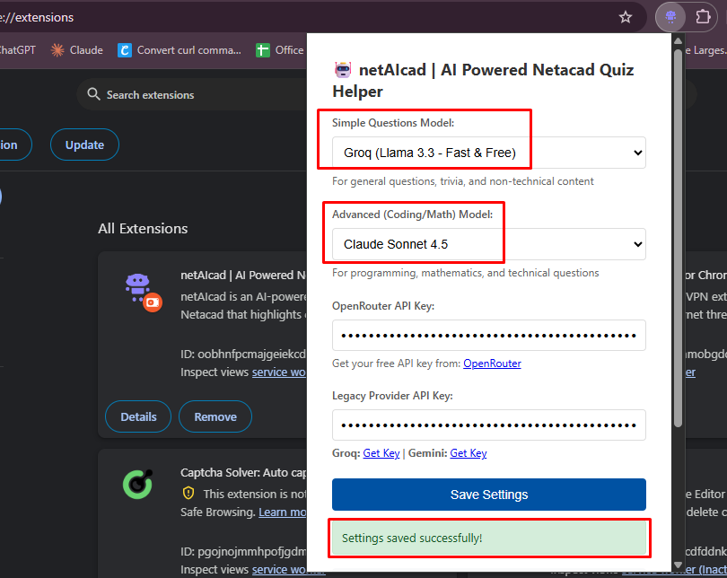
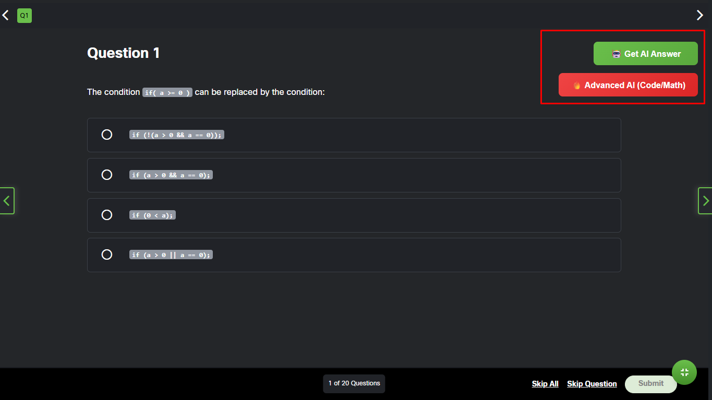
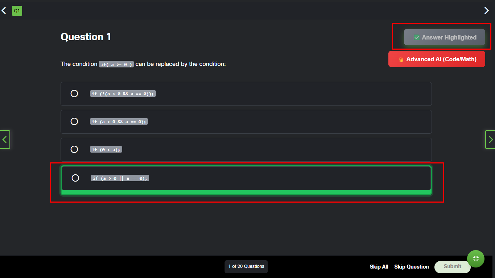
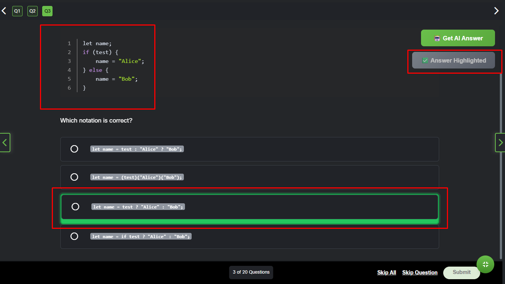
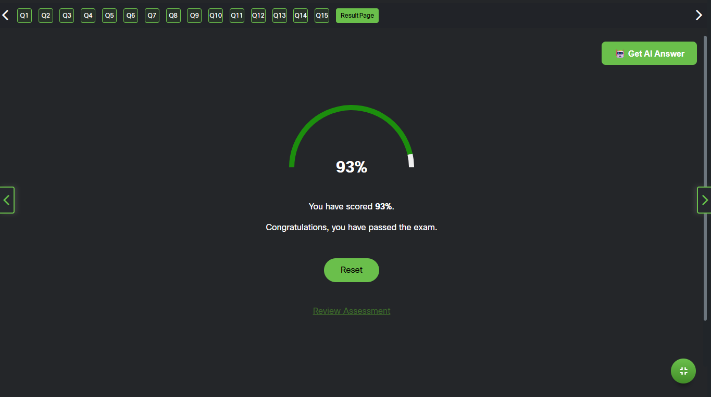
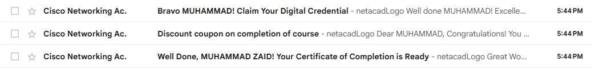

# netAIcad | AI Powered Netacad Quiz Helper

`netAIcad` is a Chrome/Firefox extension that uses AI to help answer Netacad quiz questions by highlighting the correct option.

## Features

- 🤖 **Dual AI Model System** for different question types:
  - **Simple Model**: For general questions, trivia, and non-technical content
  - **Advanced Model**: For programming, mathematics, and technical questions
- 🔥 **8 OpenRouter AI Models** including:
  - Claude Sonnet 4.5, GPT-5 Pro, GPT-5 Codex
  - Qwen3 Coder Plus, DeepSeek, Grok 4 Fast, GLM 4.6
- ⚡ **Legacy Provider Support**:
  - **Groq** (Fast & Free with Llama 3.3)
  - **Google Gemini** (Free tier available)
- 🎯 Automatic question and option extraction from Netacad quizzes
- ✨ Visual highlighting of suggested correct answers
- 🔐 Secure API key storage
- 🎨 Clean and intuitive dual-button UI
- 💡 Smart model selection for optimal accuracy

## Installation

### Chrome

1. Open Chrome and navigate to `chrome://extensions/`
2. Enable "Developer mode" in the top right
3. Click "Load unpacked"
4. Select the `netAIcad` folder
5. The extension should now appear in your extensions list

### Firefox

1. Open Firefox and navigate to `about:debugging#/runtime/this-firefox`
2. Click "Load Temporary Add-on"
3. Navigate to the `netAIcad` folder and select `manifest.json`
4. The extension should now be loaded

## Setup

### 1. Get API Keys (FREE options available!)

**Option A: OpenRouter** (⭐ Recommended - Access to 8+ Models)
- Sign up at [OpenRouter](https://openrouter.ai/)
- Get your free API key from [OpenRouter Keys](https://openrouter.ai/keys)
- Access Claude Sonnet 4.5, GPT-5 Pro, and more models

**Option B: Legacy Providers** (Still Supported)
- **Groq** (Fast & Free): [Groq Console](https://console.groq.com/keys)
- **Google Gemini** (Free tier): [Google AI Studio](https://makersuite.google.com/app/apikey)

### 2. Configure the Extension

1. Click the extension icon in your browser toolbar
2. **Select models for each use case:**
   - **Simple Questions Model**: Choose for general/trivia questions
     - Options: Groq, Gemini, DeepSeek, Qwen3 Coder Flash
   - **Advanced (Coding/Math) Model**: Choose for technical questions
     - Options: Claude Sonnet 4.5, GPT-5 Pro, GPT-5 Codex, Qwen3 Coder Plus, Grok 4 Fast, GLM 4.6
3. **Enter API key(s):**
   - OpenRouter API Key (if using OpenRouter models)
   - Legacy Provider API Key (if using Groq/Gemini)
4. Click "Save Settings"

### Why Use OpenRouter? 🔥

**OpenRouter** gives you access to multiple state-of-the-art models:
- ✅ Access to Claude, GPT-5, Qwen3, and more
- 🧠 Choose specialized coding models for technical questions
- 💡 Use simpler models for basic questions to save costs
- 🎯 Higher accuracy for programming and math problems
- 🆓 Free tier available with generous limits

## Usage

1. Navigate to a Netacad quiz page
2. You'll see **two buttons** on the page once the quiz iframe loads:
   - **🤖 Get AI Answer** (Green) - For general questions
   - **🔥 Advanced AI (Code/Math)** (Red) - For technical questions
3. Choose the appropriate button based on the question type:
   - Use the **green button** for general knowledge, trivia, theory questions
   - Use the **red button** for programming, mathematics, statistics, or complex technical questions
4. The extension will highlight the AI-suggested correct answer
5. Review the suggestion and make your selection

### Which Button to Use? 🤔

- **Green Button (Simple Model)**: 
  - General networking concepts
  - Theory and definitions
  - Basic troubleshooting scenarios
  - Non-technical questions

- **Red Button (Advanced Model)**:
  - Code analysis and debugging
  - Mathematical calculations
  - Complex algorithms
  - Statistical problems
  - Technical programming questions

## Screenshots

Below are some screenshots demonstrating the extension in action:

### 1. Extension Popup Settings

*Configure your API key and select your AI provider (Gemini or ChatGPT).*

---

### 2. "Get AI Answer" Button on Netacad Quiz

*The "🤖 Get AI Answer" button appears on Netacad quiz pages.*

---

### 3. Highlighted AI-Suggested Answer (Simple)

*The extension highlights the AI-suggested correct answer with a green border.*

---

### 3. Highlighted AI-Suggested Answer (Code)

*The extension highlights the AI-suggested correct answer with a green border.*

---

### 4. Get Better Result

*The extension give you better results with 90% accuracy*

---

### 5. Complete the Course in less time

*The extension complete your course in no time*

---

## How It Works

1. **Content Script** (`content.js`) runs on Netacad pages and detects quiz elements using Shadow DOM
2. Netacad uses Shadow DOM to encapsulate quiz content, so the script accesses the `mcq-view` element's shadow root
3. The script extracts question text and options from inside the shadow DOM
4. User clicks either the **green button** (simple model) or **red button** (advanced model)
5. **Background Script** (`background.js`) sends the question to the selected AI model via OpenRouter or legacy provider
6. The AI responds with only the correct option letter (A, B, C, or D)
7. The extension highlights the corresponding option with inline styles (since CSS doesn't penetrate Shadow DOM)

## Files

- `manifest.json` - Extension configuration
- `content.js` - Script that runs on Netacad pages
- `content.css` - Styles for highlighting and button
- `background.js` - Service worker that handles AI API calls
- `popup.html` - Extension settings popup UI
- `popup.js` - Popup functionality

## Privacy & Security

- API keys are stored locally in Chrome's sync storage
- No data is sent to any server except the AI provider you choose
- The extension only runs on `netacad.com` domains

## Limitations

- AI suggestions may not always be correct - always verify answers
- Requires a valid API key (OpenRouter, Groq, or Gemini)
- **Free options available** (OpenRouter, Groq, and Gemini offer free tiers)
- API usage may incur costs for premium models
- Only works on multiple-choice questions
- For best results, use the appropriate button (simple vs advanced) based on question type

## Troubleshooting

**Extension buttons not appearing**
- Make sure you're on a Netacad quiz page with multiple choice questions
- Refresh the page after installing the extension
- Check that both green and red buttons are visible

**API errors**
- Verify your API key is correct (OpenRouter or Legacy provider)
- Check that you have API credits/quota remaining
- Ensure you selected models that match your API key
- For OpenRouter models, make sure you entered the OpenRouter API key

**No answer highlighted**
- Check the browser console for errors (F12)
- Verify the question format is supported
- Try switching between simple and advanced models
- Ensure the correct model is configured for the button you clicked

**Wrong model being used**
- Check which button you clicked (green = simple, red = advanced)
- Verify model selections in the extension popup
- Make sure the appropriate API key is configured

## Disclaimer

This extension is for educational purposes only. Always verify AI suggestions and use your own judgment when answering quiz questions.
